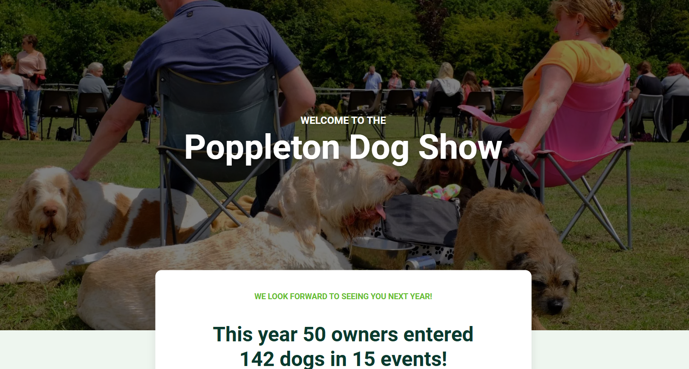

This project demonstrates the development of a Web Application about a dog show in Poppleton using technologies such as MySQL and PHP. The purpose was to generate dynamic content based on a relational database without any help from frameworks, made in pure PHP/HTML and manual setup, as to adhere to the given requirements.

There are detailed insights provided such as the number of participants, their dogs, the number of events, as well as a top 10 leaderboard based on average score. There is also an extra page displaying owner contact information by ID.

There are two main pages/parts of the site, which include:

1. **Homepage** – Displays a neat homepage with the statistics of the show from the current year, and acts as the default page should there have been a fully finished site. It also contains the leaderboard of the top 10 dogs.

2. **Owner Details** – An extra page which dynamically changes based on the dog owner and provides information about the owner's contact information.

Everything was originally created as a front-end using just HTML. Although the specification said that styling is not required, it would have been a shame to not make it look nice and neat. Everything else was created using a local environment. I used XAMPP specifically, as this seemed to be the best approach since I was introduced to it. It has the Apache server built-in as well as MySQL, all to dynamically view the site as I was going along.

I have adhered to the requirements quite well, although it doesn’t line up exactly as outlined. I have made some differences compared to the description — for example, the email is not provided in the table, but instead is included on the contact card of the customer when clicking on the name.

The project still demonstrates effective use of PHP to handle server-side scripting, MySQL for database management, and HTML/CSS for presentation, with styling of the site included to demonstrate skill and adherence to a structured and modular coding approach.

